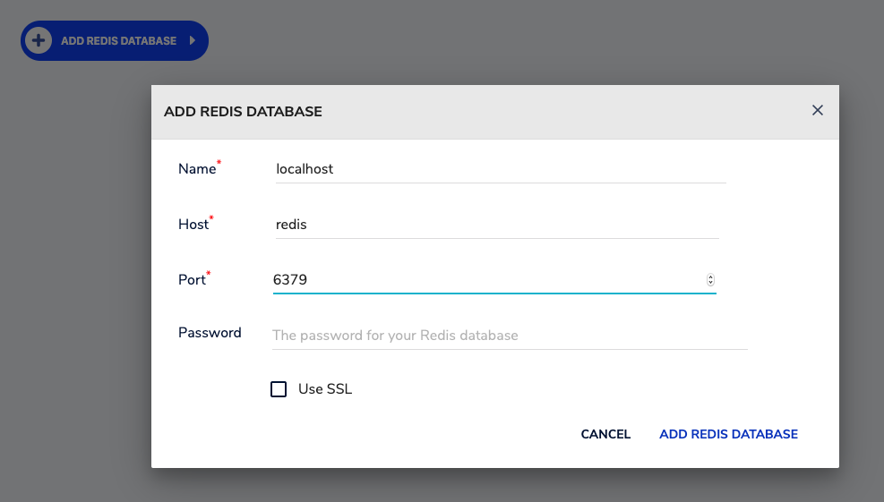

# redisJupyter
redis Jupyter notebooks covering redis concepts
## Initial project setup
Get this github code
```bash 
git clone https://github.com/jphaugla/redisJupyter.git
```
## docker compose startup
```bash
cd compose
docker-compose up -d 
cd ..
```
### run the requirements script
```bash
docker exec -it jupyter bash -c "pip install -r demo/requirements.txt"
```
### open jupyter
as a security measure, a token must be provided to open jupyter.  
1.  get the jupyter container logs and copy the browser address 
```
docker logs jupyter
```
(hint:  look for the phrase "copy and paste one of these URLs:")
2.  open jupyter with your token (don't run this command it is an example)
http://127.0.0.1:8888/?token=6bb4cab7ecc40dbbef127491dd93a1ecde1f6f6a0be9ff24
### open redisinsights
http://localhost:8001
3.  add a redis database
Click on "ADD REDIS DATABASE"

